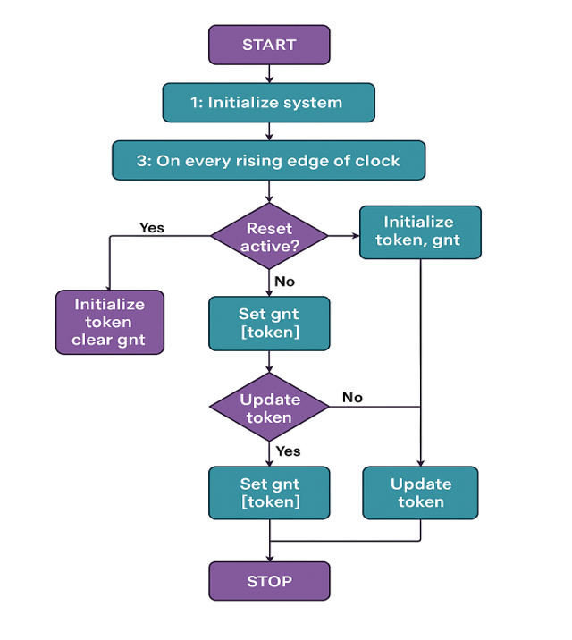
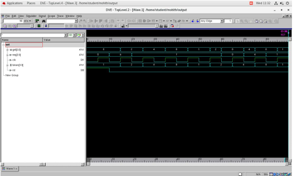
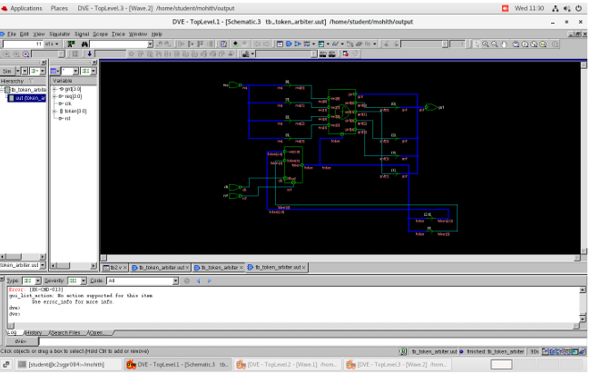
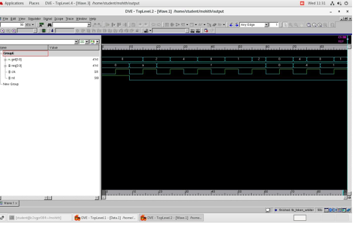

You are a Senior RTL Design Engineer, FPGA Engineer, and Technical Documentation Specialist.

Your task is to generate a professional GitHub README.md for my Verilog HDL project.

IMPORTANT:
- Output ONLY valid Markdown.
- Do NOT include any explanations before or after the README.
- Do NOT repeat this prompt.
- Do NOT write "You are..." anywhere in the README.
- Do NOT include AI-generated disclaimers.
- Do NOT mention OpenAI, ChatGPT, Claude, Gemini, Antigravity, or any AI tool.
- Do NOT invent features that are not present in the project.
- Write as if this repository is maintained by an embedded systems engineer.
- Use professional GitHub formatting with emojis, tables, badges, code blocks, and images.

Project Information
===================

Project Name:
Priority-Based Token Passing Arbiter

Description:
A Verilog HDL implementation of a Priority-Based Token Passing Arbiter that provides fair and starvation-free arbitration among multiple requesters using a rotating token mechanism.

Language:
Verilog HDL

Testbench:
SystemVerilog

Project Features:
- Token-based arbitration
- Fair scheduling
- Starvation-free resource allocation
- Deterministic grant generation
- RTL implementation
- Functional verification
- Clock synchronous operation
- Rotating token mechanism
- Synthesizable design

Repository Structure

docs/
priority_based_token.pdf

images/
block_diagram.png
flowchart.png
waveform1.png
waveform2.png
waveform3.png

rtl/
priority_token.v

testbench/
priority_token_tb.v

README.md

Working Principle

The arbiter initializes the token during reset.

On every clock cycle:

1. Checks whether the requester owning the token has asserted a request.

2. If yes, generates a grant.

3. Rotates the token.

4. Repeats continuously.

Simulation verifies:

- Correct token rotation
- Fair resource allocation
- One grant per clock
- Proper synchronization
- Starvation-free operation

Applications

- FPGA Design
- ASIC Design
- SoC
- NoC
- Bus Arbitration
- DMA Controllers
- Memory Controllers
- Embedded Systems
- Digital Hardware Design

Future Improvements

- Configurable number of requesters
- Dynamic priority support
- FPGA implementation
- Performance optimization
- AXI/AHB integration

Images

Include these image sections exactly:

## Block Diagram

## Flowchart

## Simulation Waveforms

Documentation

Include a section linking to:

docs/priority_based_token.pdf

Author

Developed by Mohith M

Footer

Include a professional footer encouraging users to star the repository.

README Requirements

The README must contain:

- Title
- Badges
- Project Overview
- Objectives
- Features
- Technology Stack (table)
- Project Structure (tree)
- Working Principle
- Step-by-Step Algorithm
- Functional Analysis
- RTL Design Overview
- Simulation Results
- Block Diagram
- Flowchart
- Waveforms
- Applications
- Future Enhancements
- Project Report
- Author
- License
- Professional Footer

Formatting

- Use horizontal separators.
- Use GitHub-flavored Markdown.
- Use clean tables.
- Use emoji section headers.
- Use fenced code blocks.
- Make it visually attractive.
- Keep line lengths readable.
- Ensure all image paths match the repository structure.
- The output should be ready to paste directly into README.md without any editing.
