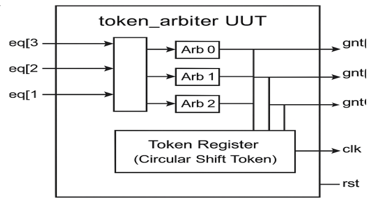

<div align="center">

# 🔄 Priority-Based Token Passing Arbiter

### Fair, Starvation-Free Resource Arbitration using Verilog HDL

<p align="center">


</p>

Design and implementation of a **Priority-Based Token Passing Arbiter** for efficient and starvation-free resource arbitration in digital systems.

</div>

---

# 📖 Project Overview

The **Priority-Based Token Passing Arbiter** is a digital hardware design developed using **Verilog HDL** to efficiently manage access to a shared resource among multiple requesters.

Unlike conventional fixed-priority arbiters, this design employs a **rotating token mechanism** that ensures every requester receives fair access while eliminating starvation. The arbiter grants access only to the requester currently holding the token and requesting the shared resource.

The complete design has been simulated and functionally verified using **Icarus Verilog** and **GTKWave**.

---

# 🎯 Objectives

- Design a Priority-Based Token Passing Arbiter using Verilog HDL.
- Implement fair resource arbitration using a rotating token.
- Eliminate starvation among multiple requesters.
- Develop an RTL implementation suitable for digital hardware.
- Verify functionality through simulation.
- Analyze system behavior using waveform visualization.

---

# ✨ Features

- 🔄 Token-Based Arbitration
- ⚖️ Fair Scheduling Mechanism
- 🚫 Starvation-Free Access
- ⚡ RTL Design using Verilog HDL
- 🧪 Functional Verification
- 📊 GTKWave Waveform Analysis
- 🖥️ Synthesizable Hardware Design
- 📈 Deterministic Grant Generation

---

# 🛠 Technology Stack

| Category | Technology |
|----------|------------|
| Hardware Description | Verilog HDL |
| Verification | SystemVerilog Testbench |
| Simulator | Icarus Verilog |
| Waveform Viewer | GTKWave |
| IDE | Visual Studio Code |
| Platform | Windows / Linux |

---

# ⚙️ Working Principle

The arbiter follows a rotating token mechanism to determine which requester receives access to the shared resource.

### Step-by-Step Process

1. System initializes the token during reset.
2. Multiple requesters generate access requests.
3. The requester holding the current token is checked.
4. If a valid request exists, the arbiter grants access.
5. The token rotates to the next requester on the next clock cycle.
6. The process repeats continuously, ensuring fairness.

---

# 📂 Project Structure

```
priority-based-token-passing-arbiter/
│
├── docs/
│   └── Project_Report.pdf
│
├── images/
│
├── rtl/
│   └── token_arbiter.v
│
├── simulation/
│
├── testbench/
│   └── tb_token_arbiter.v
│
├── README.md
├── LICENSE
└── .gitignore
```

---

# 📊 Functional Analysis

The implemented arbiter provides:

- Fair arbitration among all requesters.
- Deterministic grant generation.
- Continuous token rotation.
- One grant per clock cycle.
- Starvation-free operation.
- Conflict-free resource allocation.

---

# 📈 Simulation Results

The design was successfully verified using **Icarus Verilog**.

Simulation confirms:

- Correct token rotation.
- Accurate request-to-grant mapping.
- Proper synchronization with the system clock.
- Fair allocation of shared resources.
- Expected waveform behavior in GTKWave.

---

# 🎯 Applications

- System-on-Chip (SoC)
- Network-on-Chip (NoC)
- Memory Controllers
- Bus Arbitration
- DMA Controllers
- FPGA Designs
- Embedded Systems
- Digital Communication Systems

---

# 🚀 Future Enhancements

- Dynamic Priority Scheduling
- Configurable Number of Requesters
- FPGA Hardware Implementation
- AXI Bus Integration
- Deadlock Detection
- Performance Optimization for Large Systems

---

# 📚 Development Tools

- Verilog HDL
- Icarus Verilog
- GTKWave
- Visual Studio Code
- Git & GitHub

---

# 📷 Project Images

You can add the following images inside the **images/** folder.

- Block Diagram
- Flowchart
- RTL Architecture
- GTKWave Output
- Simulation Results

Example:

```markdown



```

---

# 👥 Team Project

This project was developed as part of an academic team project.

### My Contributions

- RTL Design
- Functional Verification
- Simulation
- Documentation
- GitHub Repository Management

---

# 📄 Project Report

The complete project documentation is available in:

```
docs/Project_Report.pdf
```

---

# 📜 License

This project is released under the **MIT License**.

---

<div align="center">

### ⭐ If you found this project useful, consider giving it a star!

**Developed by Mohith M**

Embedded Systems • IoT • Edge AI • Digital Design

</div>